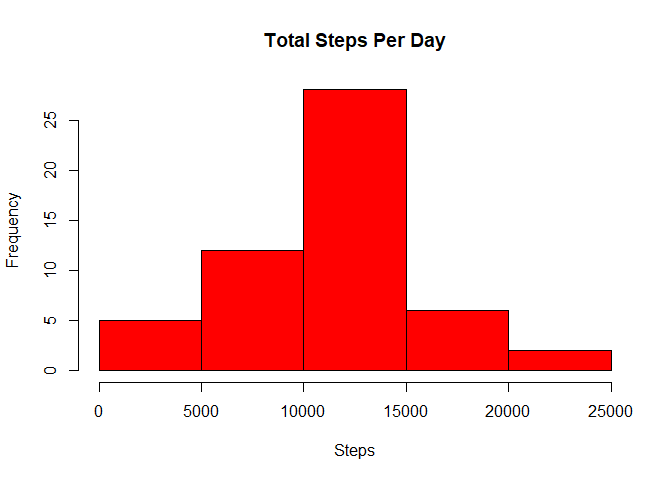
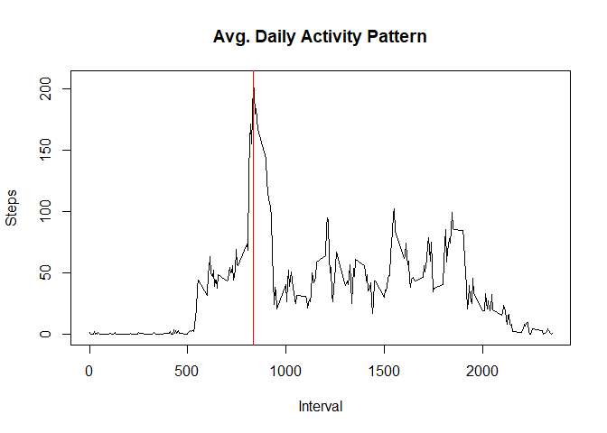
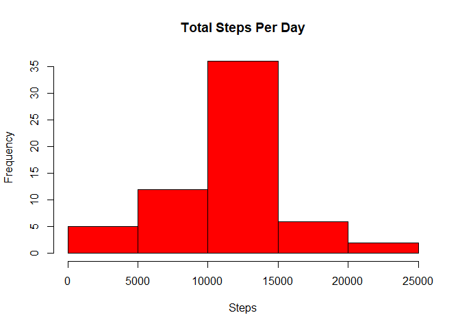
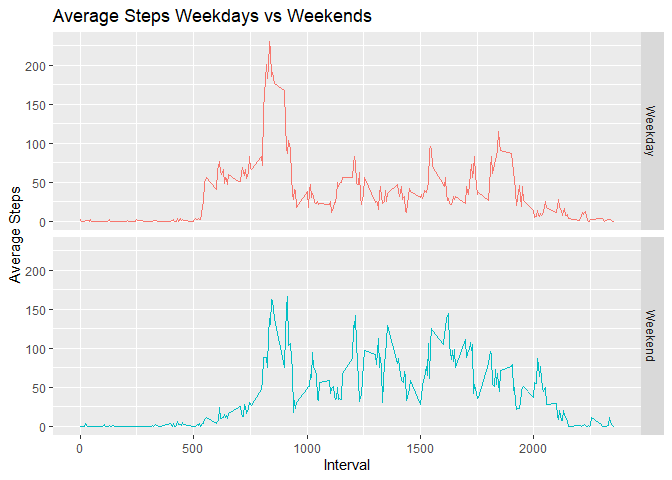

## Loading and preprocessing the data

```r
suppressWarnings(library(knitr))
opts_chunk$set(echo = TRUE, warning = FALSE, message = FALSE)
library(lubridate)
suppressWarnings(library(ggplot2))
library(dplyr)
options(scipen=999)
```

```r
df <- read.csv("./Data/activity.csv")
df$date <- ymd(df$date)
sumdf <- aggregate(steps ~ date, df, sum)
avgdf <- aggregate(steps ~ interval, df, mean)
```

## What is mean total number of steps taken per day?

```r
hist(sumdf$steps,
     col = "red",
     main = "Total Steps Per Day",
     xlab = "Steps")
```

<!-- -->

```r
meansteps <- round(mean(sumdf$steps),2)
mediansteps <- median(sumdf$steps)
```
The mean number of steps per day is 10766.19  
The median number of steps per day is 10765

## What is the average daily activity pattern?

```r
plot(avgdf$interval, avgdf$steps, type='l',
     main = "Avg. Daily Activity Pattern",
     xlab = "Interval",
     ylab = "Steps")
abline(v = 835, col = 'red')
```

<!-- -->

```r
maxsteps <- which.max(avgdf$steps)
maxint <- avgdf[104,1]
maxint2 <- round(avgdf[104,2],2)
```
The 5-minute interval with the highest average number of steps is 835 with 206.17 steps

## Imputing missing values

```r
NAs <- sum(is.na(df))
```

```r
imputed_means <- ave(df$steps, df$interval, FUN=function(x) 
        ifelse(is.na(x), mean(x,na.rm=TRUE), x))
impdf <- df
impdf['steps'] <- round(imputed_means, 2)
sumdf2 <- aggregate(steps ~ date, impdf, sum)
```

```r
hist(sumdf2$steps,
     col = "red",
     main = "Total Steps Per Day",
     xlab = "Steps")
```

<!-- -->

```r
meansteps2 <- round(mean(sumdf2$steps),2)
mediansteps2 <- median(sumdf2$steps)
```
The total number of missing values is 2304  
The mean number of steps per day is 10766.18  
The median number of steps per day is 10766.13  
As a result of imputing the NA values, there is a higher frequency of days between 10000 and 15000 steps.  
This is because all of the NA values are full days that are missing, so they are all being imputed with the  
same number of total steps.  
The mean and median are almost exactly the same.  This makes sense as we imputed using the interval means so that  
should not change much as the only difference will be in the rounding of these intervals vs the daily mean.

## Are there differences in activity patterns between weekdays and weekends?

```r
df2 <- impdf |>
        mutate(day = weekdays(date)) |>
        mutate(daytype = as.factor(if_else(day %in% c("Saturday","Sunday"), "Weekend", "Weekday")))
```

```r
avgdf2 <- df2 %>% group_by(interval, daytype) %>% summarize(steps = mean(steps, na.rm=TRUE))

ggplot(data = avgdf2, aes(interval, steps, color = daytype)) +
        facet_grid(daytype ~ .) +
        geom_line() +
        theme(legend.position="none") +
        labs(title = "Average Steps Weekdays vs Weekends", x = "Interval", y ="Average Steps")
```

<!-- -->


